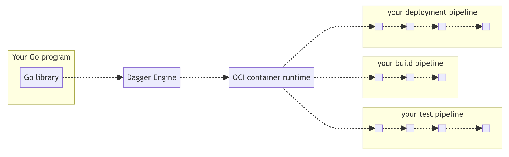

## Before we dive in

We will be using Go for the example pipeline definition.

There are currently two ways to define a Dagger pipeline:

1. Dagger functions, e.g. a function for each stage (build, test, deploy etc.).
2. A single Dagger pipeline function that contains all the stages.

Dagger functions are relatively new and while they would in practice be more ideal to encapsulate and moduralize the pipeline, we will use the single Dagger pipeline function for the exercises. It is compact and simpler to maintain when workflows are small.

 
 
 
 
 
 
 
 
 
 
 

## Typical Dagger pipeline structure

1. A pipeline in Go in its simplest form is a single file, e.g. `pipeline.go`.
2. The pipeline starts through the entry point function `main()`.
3. A Dagger client and background context is created. This is what orchestrates Docker under the hood and is responsible for building the execution graph.
4. Pipeline stages are defined. These consist of the code you want to run, e.g. shell commands.

 
 
 
 
 
 
 
 
 
 
 

 
 
 
 
 
 
 
 
 
 
 

## How it works

*Source: https://archive.docs.dagger.io/0.9/sdk/go/*

 

When you run a Dagger pipeline using the Go SDK, the following happens:

1. **Client initialization**: Your Go program imports the Dagger Go SDK and creates a client connection by calling `dagger.Connect(ctx)`. The SDK handles all the GraphQL translation internally—you don't need to know GraphQL.

2. **Engine provisioning**: The client either connects to an existing Dagger Engine or automatically provisions a new one on-the-fly. The Engine runs as an OCI-compatible (Open Container Initiative) container and acts as the runtime for your pipeline.

3. **Session creation**: Once connected, your client opens a session with the Engine. Each session gets its own GraphQL server instance that manages the API requests for that session.

4. **Pipeline definition**: Your Go code defines the pipeline operations (like creating containers, mounting directories, executing commands) using the SDK's type-safe API. These operations are translated into GraphQL queries that describe your workflow.

5. **Lazy evaluation**: The Engine uses lazy evaluation—operations are only executed when their results are actually needed. For example, if you define a container build but never request its output, the build won't run. This allows the Engine to optimize away unnecessary work.

6. **DAG computation**: When a result is requested (a "leaf value" like `stdout` or exported files), the Engine computes a Directed Acyclic Graph (DAG) of all operations needed to produce that result. This graph represents the execution plan.

7. **Concurrent execution**: The Engine executes operations in the DAG concurrently wherever possible, maximizing parallelism and performance while respecting dependencies between operations.

8. **Result delivery**: Once all required operations complete, the Engine returns the results to your Go program. These results can be used as inputs to subsequent pipeline stages or exported to your local filesystem.

 

*Source: https://docs.dagger.io/manuals/developer/architecture/ and https://docs.dagger.io/api/internals/*

 
 

Ok.. Let's continue and start building a pipeline! <i class="fa-solid fa-rocket"></i>

 
 
