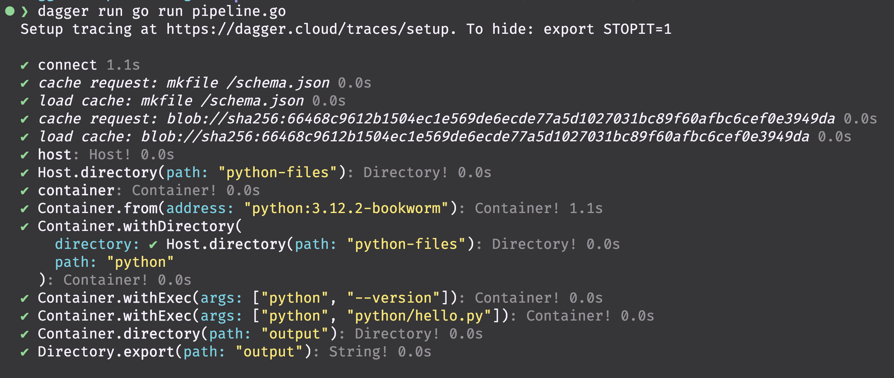

## Run the pipeline locally

Open the terminal and nagivate to the directory where the `pipeline.go` file is located and run:

```bash
dagger run go run pipeline.go
```

That is it!

The very first time you run a pipeline, Dagger will download the necessary Docker images and set up the environment. This may take a few minutes.

</br>
</br>
</br>
</br>
</br>
</br>
</br>
</br>
</br>
</br>
</br>

## Expected output



</br>
</br>
</br>
</br>
</br>
</br>
</br>
</br>
</br>
</br>
</br>

## Hold on, let's recap what happened

1. The Dagger engine create a new container based on the image `python:3.12.2-bookwork`.
2. It injected the files located in the folder `python-files` on the host file system into the container's file system.
3. It then ran the python script inside the container.
4. The python script generated a `.txt` file inside the container.
5. Finally the workflow copied the `.txt` file from the container to the host file system, under a folder called `/output`.

</br>

The output `hello-from-python.txt` file should contain the following:

```
Hello from Python in Dagger!
```

</br>
</br>
</br>
</br>
</br>
</br>
</br>
</br>
</br>
</br>
</br>

Next, let's run the pipeline in a GitHub Action workflow.

</br>
</br>
